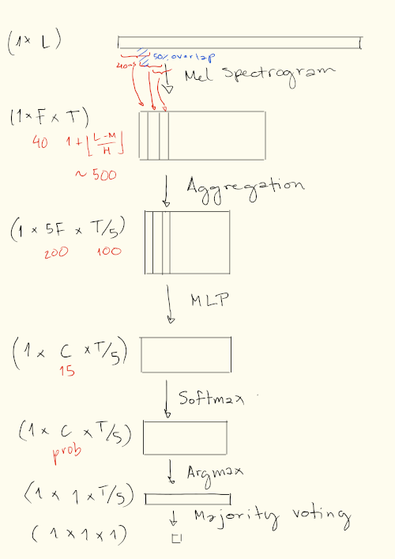

# Deep Learning for Audio Processing WS25/26

## Git Repository with Pytorch Lightning Framework

This Git repository contains a basic Pytorch Lightning framework for the Deep Learning for Audio Processing (DLAP) project, which is oriented on the DCASE challenge. It should pose as a starting point for your code-basis and provide you with the structure to recreate the DCASE baseline. Each group has their own repository with a duplicate of this framework. The first steps in using it should be:
- Clone the reposiory on your local machine with `git clone link_to_your_repo`
- Create a new virtual environment with `python -m venv your_venv_name`
- Install the package in development mode with `pip install -e .`

We strongly advise to stick with your Git repository at all times. Modify the `.gitignore` to only push neccessary code, e.g. exclude large files (audio) or your virtual environment. It is recommended to always use `git status` and `git add` files or folders individually instead of adding everything at once. Always keep your local version synchonized with the remote repository. 

## Computing Resources

Each group is assigned a specific machine with an *NVIDIA GeForce RTX 3070* GPU (8 GB VRAM). Please always stick to the machines you are assigned to:
- **Euler** `sppc14.informatik.uni-hamburg.de`
- **Fibonacci** `sppc15.informatik.uni-hamburg.de`
- **Geschke** `sppc16.informatik.uni-hamburg.de`
- **Thabit** `sppc17.informatik.uni-hamburg.de`
- **Turing** `sppc18.informatik.uni-hamburg.de`

Do not turn off or reboot these computers. You can find the training and validation datasets in the folder `/data/baproj/dlap`. In order to work remotely on your machines, it is highly recommendable to set up a `ssh` config in VS-Code.

## Baseline System

Your first task will be to code the DCASE baseline system. You can already find an empty skeleton in `models.py`. This baseline consists of a Multilayer Perceptron (MLP) architecture with roughly 16k learnable parameters (CHAT-GPT3 has 175 billion). A high-level schematic of the baseline framework is given below:


Here is a more detailed summary of the network architecture:
- The implementation is based on a multilayer perceptron architecture (MLP) and uses log mel-band energies as features.
- The features are calculated in frames of 40 ms with a 50% overlap, using 40 mel bands covering the frequency range 0 to 22050 Hz. 
- The feature vector was constructed using a 5-frame context, resulting in a feature vector length of 200.
- The MLP consists of two hidden dense layers of 50 hidden units each, with 20% dropout.
- The network is trained using Adam algorithm for gradient-based optimization.
- Training is performed for maximum 200 epochs using a learning rate of 0.001, and uses early stopping criteria with monitoring started after 100 epochs and a 10 epoch patience.
- The baseline system was tailored to a multi-class single label classification setup, with the network output layer consisting of softmax type neurons representing the 15 classes. 
- The classification decision was based on the output of the neurons, which can be active only one at a time.
- Frame-based decisions were combined using majority voting to obtain a single label per classified segment.
- The system performance was measured using accuracy, defined as the ratio between the number of correct system outputs and the total number of outputs. 

With a correct setup, you should achieve > 60% accuracy on the validation dataset.

## Training

The project supports multiple model architectures via YAML configuration files. Use the `--config` argument to select which model to train.

### Available Models

| Model | Config | Description |
|-------|--------|-------------|
| `BaselineModel` | `baseline.yaml` | DCASE baseline MLP with 5-frame context (200 input features) |
| `LinSeqModel` | `linseq.yaml` | Extended linear sequential model |

### Usage

```bash
python3 dcase/src/train.py --config dcase/src/config/baseline.yaml
python3 dcase/src/train.py --config dcase/src/config/linseq.yaml
```